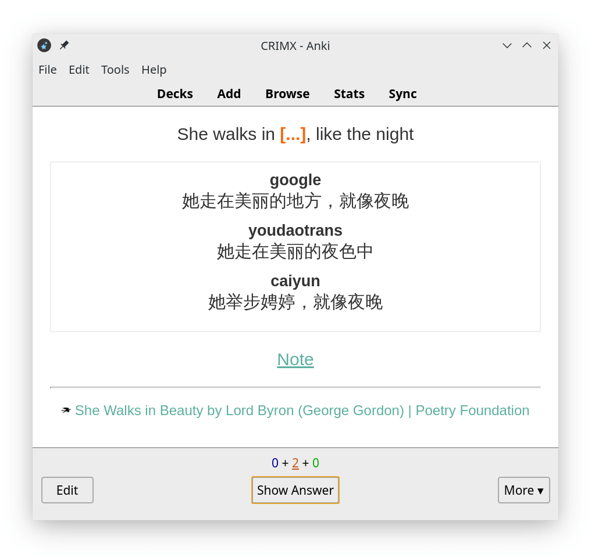

# Using Saladict with Anki

## Why use Anki?

YJango's video ["What We Got Wrong About Language Learning for More Than a Decade"](https://zhuanlan.zhihu.com/p/51717106) explores an approach that closely aligns with Saladict's design philosophy.

<iframe width="100%" height="540" src="https://www.youtube.com/embed/TlP4iwFum2g" title="YouTube video player" frameborder="0" allow="accelerometer; autoplay; clipboard-write; encrypted-media; gyroscope; picture-in-picture" allowfullscreen></iframe>

Most vocabulary apps show you a word along with several common definitions and ask you to memorize those associations. Some platforms also provide extensive dialogues and authentic examples, but these usually serve as supplementary material. The word and its many definitions remain at the center of the learning process.

That approach can be useful for exam preparation, but it is less effective for learning how to use a word naturally. In a specific context, a word has one precise meaning. Learning that meaning in context follows SuperMemo's principles and makes it easier to develop an instinctive response to the word.

When you look up an unfamiliar word while reading a web page and save it to your Saladict notebook, Saladict also saves the surrounding text and generates a translation. You can sync this valuable real-world context to Anki and turn it into a polished Saladict card.

## Creating cards automatically with AnkiConnect

Saladict can create Anki cards for you, with no manual card setup required.

Install [Anki](https://apps.ankiweb.net/) and the [AnkiConnect](https://github.com/FooSoft/anki-connect) add-on:

1. In Anki, select `Tools` -> `Add-ons` -> `Get Add-ons`.
2. Enter [`2055492159`](https://ankiweb.net/shared/info/2055492159) and confirm the installation.
3. Restart Anki.

Windows may display a firewall prompt; if it does, allow Anki through the firewall. On macOS Mavericks, you may need to adjust App Nap settings to prevent Anki from being suspended. See the [AnkiConnect documentation](https://github.com/FooSoft/anki-connect#notes-for-windows-users) for details.

The default AnkiConnect settings work for most users. In Saladict, go to `Settings` -> `Notebook` and enable AnkiConnect sync.

Keep Anki running in the background while sync is enabled. You can also install the add-on [`85158043`](https://ankiweb.net/shared/info/85158043) to minimize Anki to the system tray. Whenever you save a word to your Saladict notebook, Saladict will create a card and sync it to Anki. Entries with the same `Date` value are treated as duplicates and skipped. To force an update, edit the entry in Saladict's word editor.

For example, a Saladict notebook entry might look like this:

```yml
Timestamp: 1234567890
Word: beauty
Context: >
  She walks in beauty, like the night
Translation: >
  [:: google ::]
  She walks in a beautiful place, like the night

  [:: youdaotrans ::]
  She walks in the beauty of the night

  [:: caiyun ::]
  She walks gracefully, like the night
  ---------------
Note: >
  The phrase "in beauty" makes it seem as though she carries an aura, with beauty radiating all around her.
Source Title: >
  She Walks in Beauty by Lord Byron (George Gordon) | Poetry Foundation
Source URL: >
  https://www.poetryfoundation.org/poems/43844/she-walks-in-beauty
Source Favicon: >
  https://www.poetryfoundation.org/assets/media/images/favicon-32x32.png?v=1.2.9
```

After it is saved to Anki, the note will contain:

```yml
Date: 1234567890
Text: beauty
Context: >
  She walks in beauty, like the night
ContextCloze: >
  She walks in {{c1::beauty}}, like the night
Translation: >
  <div class="trans"><span class="trans_title">google</span><div class="trans_content">She walks in a beautiful place, like the night</div><span class="trans_title">youdaotrans</span><div class="trans_content">She walks in the beauty of the night</div><span class="trans_title">caiyun</span><div class="trans_content">She walks gracefully, like the night</div></div>
Note: >
  The phrase "in beauty" makes it seem as though she carries an aura, with beauty radiating all around her.
Title: >
  She Walks in Beauty by Lord Byron (George Gordon) | Poetry Foundation
Url: >
  https://www.poetryfoundation.org/poems/43844/she-walks-in-beauty
Favicon: >
  https://www.poetryfoundation.org/assets/media/images/favicon-32x32.png?v=1.2.9
Audio: ''
```

`Date`, `Text`, `Context`, `ContextCloze`, `Translation`, `Note`, `Title`, `Url`, `Favicon`, and `Audio` are the Anki note's fields.

If you want to customize the cards, keep these field names unchanged and edit the existing card type or add a new one instead. One of Anki's key features is the separation between notes and cards.

Most of these fields map directly to the Saladict entry shown above. The two additional fields are `ContextCloze` and `Audio`. The `Audio` field is reserved for a future pronunciation feature. In `ContextCloze`, Saladict replaces the keyword `beauty` with <code v-pre>{{ c1::beauty }}</code>, which Anki uses to generate a cloze card. The original sentence remains available in `Context`, so you can use it to create other card types.

With Saladict's default cloze card template, the front of the card looks like this:



The keyword is hidden automatically, the generated translations are formatted for you, and your personal note is hidden behind a hint that you can click to reveal. The source appears at the bottom.

The back of the card looks like this:


## Importing notes from a text file

Anki can also import notes from a text file. AnkiConnect is generally more convenient when it is available.

### Create a note type

Before importing your first file, create a note type in Anki. The built-in note type only provides `Front` and `Back` fields, though you can use it if those fields are all you need.

1. Select `Tools` -> `Manage Note Types` to view your note types, then click `Add`.
2. Choose `Add: Basic` for a simple starting point. More advanced note types are also available.
3. Enter a name, such as `Saladict Notebook`.
4. Select the new note type in the list and click `Fields`.
5. Anki provides `Front` and `Back` by default. Delete or rename them, then add the Saladict fields you need: `Word`, `Context`, `Translation`, `Note`, `Source Title`, `Source URL`, and `Source Favicon`. For this example, add `Word`, `Context`, `Translation`, and `Note` in that order.
6. Anki will warn you that the next sync requires a full upload. Confirm this if all your other devices are already synchronized.
7. Click `Close` to return to the note type list, then click `Cards` to edit the card templates.
8. The card editor has separate templates for the front and back. Field names inside `{{}}` are replaced with the corresponding content from each note. Here is a simple template:

   Front template:

   ```html
   <p>{{Word}}</p>

   <p>{{Context}}</p>
   ```

   Back template:

   ```html
   {{FrontSide}}

   <hr id=answer>

   <p>{{Translation}}</p>

   <p>{{Note}}</p>
   ```

9. Click `Close` when you are done. Your note type is now ready to use.

### Export words from Saladict

Open the Saladict notebook or search history and export either the selected entries or all entries. Anki will detect duplicates automatically.

In the export editor, arrange the placeholders in the same order as the fields in your Anki note type. Use a backtick (the key to the left of <kbd>1</kbd>) as the delimiter to reduce the chance of conflicts with your content.

For the field order used above (`Word`, `Context`, `Translation`, and `Note`), use this export template:

```
%text% ` %context% ` %trans% ` %note%
```

Anki processes text imports one line at a time. Exported fields such as automatic translations may contain multiple lines, so change the `Preserve line breaks` setting at the top of the export editor:

- Select `Replace line breaks with spaces` to export each entry without line breaks.
- Select `Replace line breaks with <br>` or `Replace line breaks with <p>` to preserve the layout with HTML tags that Anki can interpret. With the default card styling, `<br>` produces tighter spacing than `<p>`.

Export and save the file.

### Import words into Anki

In Anki, select `File` -> `Import`, choose the exported file, and set the import type to `Text separated by tabs or semicolons`.

Configure the Import dialog as follows:

- Set `Type` to the note type created above, such as `Saladict Notebook`.
- Select a `Deck` for the imported cards. Anki uses `::` to separate levels in a deck hierarchy. You can select an existing deck or click `Add` to create one; for example, `Vocabulary::Saladict`.
- Change `Fields separated by` from `Space` to a backtick (`` ` ``).
- Adjust the duplicate handling options as needed, or leave the defaults unchanged.
- Enable `Allow HTML in fields` if you used HTML tags such as `<br>` or `<p>` when exporting.
- Check the `Field Mapping` section to make sure Anki has matched the four imported fields to the fields in your note type.
- Click `Import` to import the notes and view the results.
